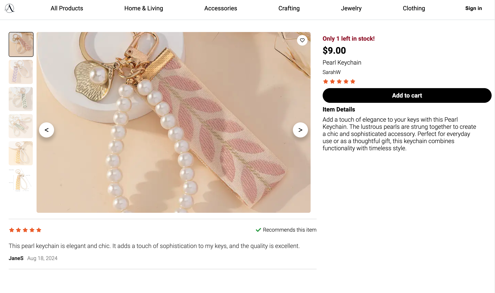
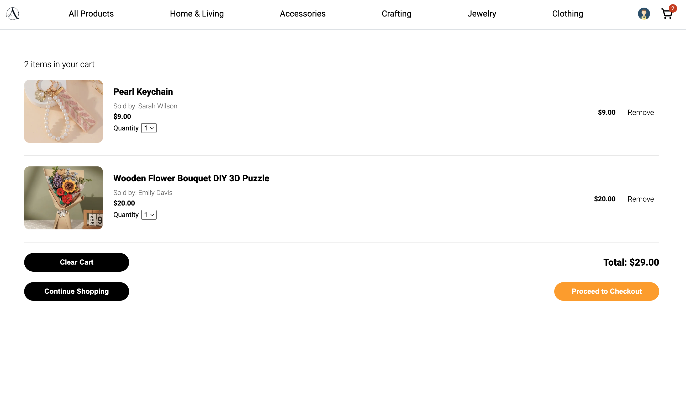
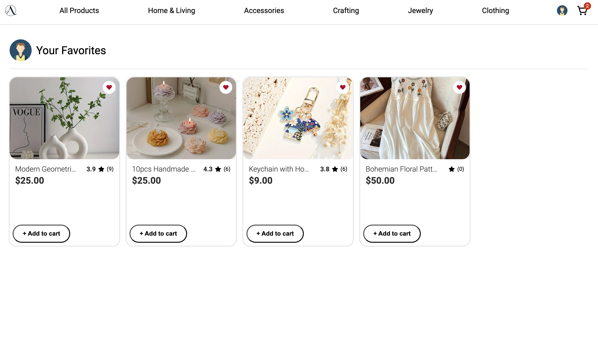

# Artisan-Alley

**Artisan-Alley** is an e-commerce application designed to offer users a seamless shopping experience. This project was inspired by the need for an efficient and user-friendly platform that combines a wide range of product offerings with robust cart management and personalized user interactions. The application includes features like product management, reviews, favorites, and cart functionality. Our goal is to continuously improve this project, making it a central piece of my software engineering portfolio.

### Live Link [Visit Artisan-Alley](https://artisan-alley.onrender.com/)

### GitHub Repository [Link to Repository](https://github.com/RoseMontoya/etsy-clone)

## Summary

Artisan-Alley is built using Flask for the backend and React for the frontend, offering a comprehensive set of tools for managing products, carts, reviews, and favorites. The application is designed to be intuitive and easy to use, providing users with a smooth shopping experience.

## Screenshots

**Home Page** 
**Product View** 
**Product Detail** 
**Cart View** 
**Favorite Products** 

## Features

### User Authentication System

- Users can sign up, log in, log out, and access protected content.

### Product Management

- Users can browse, search, and view detailed information on products. - Admin users can add, edit, and delete products.

### Cart System

- Users can add products to their cart, view the cart, clear the cart, remove products from the cart and proceed to checkout. - Cart updates automatically as products are added or removed.

### Review System

- Users can leave reviews on products they have purchased. - Reviews include a star rating and comments.

### Favorite System

- Users can add products to a favorites list for easy access later. - Favorite lists can be managed by adding or removing products.

## Endpoints

### Auth Routes

**Current User**

- **Purpose:** Authenticates the current user and returns their information if they are logged in.
- **Method:** GET
- **URL:** /api/auth/
- **Successful Response:** HTTP Status Code 200

```json
{
  "id": "integer",
  "username": "string",
  "email": "string",
  "first_name": "string",
  "last_name": "string"
}
```

- **Error Response:** HTTP Status Code 401

```json
{
  "errors": {
    "message": "Unauthorized"
  }
}
```

**Login**

- **Purpose:** Logs in a user with the provided credentials.
- **Method:** POST
- **URL:** /api/auth/login
- **Body:**

```json
{
  "email": "string",
  "password": "string"
}
```

- **Successful Response:** HTTP Status Code 200

```json
{
  "id": "integer",
  "username": "string",
  "email": "string",
  "first_name": "string",
  "last_name": "string"
}
```

- **Error Response:** HTTP Status Code 401

```json
{
  "errors": {
    "field_name": "error_message"
  }
}
```

**Logout**

- **Purpose:** Logs out the current user.
- **Method:** POST
- **URL:** /api/auth/logout
- **Successful Response:** HTTP Status Code 200

```json
{
  "message": "User logged out"
}
```

- **Error Response:** None

**Sign Up**

- **Purpose:** Creates a new user and logs them in.
- **Method:** POST
- **URL:** /api/auth/signup
- **Body:**

```json
{
  "username": "string",
  "email": "string",
  "password": "string",
  "first_name": "string",
  "last_name": "string"
}
```

- **Successful Response:** HTTP Status Code 201

```json
{
  "id": "integer",
  "username": "string",
  "email": "string",
  "first_name": "string",
  "last_name": "string"
}
```

- **Error Response:** HTTP Status Code 401

```json
{
  "errors": {
    "field_name": "error_message"
  }
}
```

**Unauthorized**

- **Purpose:** Returns an unauthorized error when authentication fails.
- **Method:** GET
- **URL:** /api/auth/unauthorized
- **Error Response:** HTTP Status Code 401

```json
{
  "errors": {
    "message": "Unauthorized"
  }
}
```

### User Routes

**Get All Users**

- **Purpose:** Fetches all users registered in the application.
- **Method:** GET
- **URL:** /api/users/
- **Successful Response:** HTTP Status Code 200

```json
[
  {
    "id": "integer",
    "username": "string",
    "email": "string",
    "first_name": "string",
    "last_name": "string",
    "profile_picture": "string"
  }
]
```

- **Error Response:** None

**Get User by ID**

- **Purpose:** Fetches details of a specific user by their ID.
- **Method:** GET
- **URL:** /api/users/<int:id>
- **Successful Response:** HTTP Status Code 200

```json
{
  "id": "integer",
  "username": "string",
  "email": "string",
  "first_name": "string",
  "last_name": "string",
  "profile_picture": "string"
}
```

- **Error Response:** HTTP Status Code 404

```json
{
  "error": "User not found"
}
```

**Get User's Products**

- **Purpose:** Fetches all products listed by a specific user (seller) by their ID.
- **Method:** GET
- **URL:** /api/users/<int:id>/products
- **Successful Response:** HTTP Status Code 200

```json
[
  {
    "id": "integer",
    "title": "string",
    "description": "string",
    "price": "float",
    "inventory": "integer",
    "category_id": "integer"
  }
]
```

- **Error Response:** None

## Product

### Product Routes

#### Get All Products Owned by Current User

- **Purpose:** Fetches all products owned by the current user.
- **Method:** `GET`
- **URL:** `/api/products/current`
- **Successful Response:** `HTTP Status 200`

  ```json
  {
      "id": "integer",
      "title": "string",
      "description": "string",
      "price": "float",
      "inventory": "integer",
      "seller_id": "integer",
      "category_id": "integer"
    "seller": [
      {
      "id": "id",
      "username": "username",
      "first_name": "first_nameername",
      "last_name": "last_name",
      "profile_url": "profile_url",
      “seller_rating”: “seller_rating”
      }
    ],
  }
  ```

- **Error Response:** `HTTP Status 401`

  ```json
  {
    "errors": {
      "message": "Unauthorized"
    }
  }
  ```

#### Get a Random Product

- **Purpose:** Fetches a random product for the landing page.
- **Method:** `GET`
- **URL:** `/api/products/random`
- **Successful Response:** `HTTP Status 200`
  ```json
  {
  "id": "integer",
  "title": "string",
  "description": "string",
  "price": "float",
  "inventory": "integer",
  "seller_id": "integer",
  "category_id": "integer"
    "preview_image": "preview_image",
    "seller": [
      {
      "id": "id",
      "username": "username",
      "first_name": "first_nameername",
      "last_name": "last_name",
      "profile_url": "profile_url",
      "seller_rating": "seller_rating"
      }
    ],
  }
  ```

#### Get All Products

- **Purpose:** Fetches all products.
- **Method:** `GET`
- **URL:** `/api/products`
- **Successful Response:** `HTTP Status 200`
  ````json
  {
    "id": "id",
    "title": "title",
    "description": "description",
    "inventory": "inventory",
    "price": "price",
    "category_id": "category_id",
    "seller_id": "seller_id",
  }
    ```
  ````
- **Error Response:** `HTTP Status 404`
  ```json
  {
    "errors": "No products found"
  }
  ```

#### Get Product by Product ID

- **Purpose:** Fetches one single product by ID.
- **Method:** `GET`
- **URL:** `/api/products/:productId`
- **Successful Response:** `HTTP Status 200`

  ```json
  {
    "id": "integer",
    "title": "string",
    "description": "string",
    "price": "float",
    "inventory": "integer",
    "seller_id": "integer",
    "category_id": "integer",
    "images": [
      {
        "id": "integer",
        "url": "string",
        "preview": "boolean"
      }
    ],
    "reviews": [
      {
        "id": "integer",
        "user_id": "integer",
        "review": "string",
        "stars": "integer"
      }
    ]
  }
  ```

- **Error Response:** `HTTP Status 404`

  ```json
  {
    "message": "Product could not be found."
  }
  ```

#### Create Product

- **Purpose:** Creates a new product.
- **Method:** `POST`
- **URL:** `/api/products/new`
- **Body:**

  ```json
  {
    "title": "string",
    "description": "string",
    "price": "float",
    "inventory": "integer",
    "category_id": "integer"
  }
  ```

- **Successful Response:** `HTTP Status 201`

  ```json
  {
   "id": "integer",
  "title": "string",
  "description": "string",
  "price": "float",
  "inventory": "integer",
  "seller_id": "integer",
  "category_id": "integer"
    "seller": [
      {
      "id": "id",
      "username": "username",
      "first_name": "first_nameername",
      "last_name": "last_name",
      "profile_url": "profile_url",
      "seller_rating": "seller_rating"
      }
    ],
  }

  ```

- **Error Response:** `HTTP Status 400`
  ```json
  {
    "Form errors:": "form.errors"
  }
  ```

#### Edit Product

- **Purpose:** Edit a product.
- **Method:** `PUT`
- **Body:**

  ```json
  {
    "title": "string",
    "description": "string",
    "price": "float",
    "inventory": "integer",
    "category_id": "integer"
  }
  ```

- **URL:** `/api/products/:productId/edit`
- **Successful Response:** `HTTP Status 200`

  ```json
  {
    "id": "integer",
    "title": "string",
    "description": "string",
    "price": "float",
    "inventory": "integer",
    "seller_id": "integer",
    "category_id": "integer"
    "seller": [
      {
      "id": "id",
      "username": "username",
      "first_name": "first_nameername",
      "last_name": "last_name",
      "profile_url": "profile_url",
      "seller_rating": "seller_rating"
      }
    ],
  }

  ```

- **Error Response:** `HTTP Status 400`
  ```json
  {
    "Form errors:": "form.errors"
  }
  ```

#### Delete Product

- **Purpose:** Delete a product.
- **Method:** `DELETE`
- **URL:** `/api/products/:productId`
- **Successful Response:** `HTTP Status 200`

  ```json
  { "message": "Successfully deleted" }
  ```

- **Error Response:** `HTTP Status 404`

  ```json
  { "error": "Product not found" }
  ```

#### Get All Preview Images

- **Purpose:** Fetches all preview images for products in the store.
- **Method:** GET
- **URL:** /api/products/preview-images
- **Successful Response:** HTTP Status 200

```json
[
  {
    "id": "integer",
    "product_id": "integer",
    "url": "string",
    "preview": "boolean"
  }
]
```

- **Error Response:** None

**Get Images for a Product**

- **Purpose:** Fetches all images associated with a specific product by its ID.
- **Method:** GET
- **URL:** /api/products/<int:product_id>/images
- **Successful Response:** HTTP Status 200

```json
{
  "images": [
    {
      "id": "integer",
      "url": "string",
      "preview": "boolean"
    }
  ]
}
```

- **Error Response:** None

**Create Product Image**

- **Purpose:** Adds a new image to an existing product.
- **Method:** POST
- **URL:** /api/products/images/new
- **Body:**

```json
{
  "product_id": "integer",
  "url": "string",
  "preview": "boolean"
}
```

- **Successful Response:** HTTP Status 201

```json
{
  "id": "integer",
  "product_id": "integer",
  "url": "string",
  "preview": "boolean"
}
```

- **Error Response:** HTTP Status 400

```json
{
  "errors": {
    "field_name": "error_message"
  }
}
```

**Edit Product Image**

- **Purpose:** Edits an existing product image by its ID.
- **Method:** PUT
- **URL:** /api/products/images/<int:imageId>
- **Body:**

```json
{
  "url": "string"
}
```

- **Successful Response:** HTTP Status 200

```json
{
  "id": "integer",
  "product_id": "integer",
  "url": "string",
  "preview": "boolean"
}
```

- **Error Response:** HTTP Status 400

```json
{
  "errors": {
    "field_name": "error_message"
  }
}
```

**Delete Product Image**

- **Purpose:** Deletes a product image by its ID.
- **Method:** DELETE
- **URL:** /api/products/images/<int:imageId>
- **Successful Response:** HTTP Status 200

```json
{
  "message": "Successfully deleted"
}
```

- **Error Response:** HTTP Status 404

```json
{
  "error": "Image not found"
}
```

## Reviews

### Get Review Stats for a Product

Returns the total stars and review count for a specific product

- Method: GET
- URL: /api/reviews/review-stats/:productId
- Successful Response: HTTP Status 200

```json
{
  "product_id": "integer",
  "stars_total": "integer",
  "review_count": "integer"
}
```

- Error Response: HTTP Status 200 (when no reviews exist for the product)

```json
{
  "stars_total": 0,
  "review_count": 0
}
```

### Get all Reviews by Product Id

Gets all reviews for a product.

- Require Authentication: false
- Request

  - Method: GET
  - URL: /products/:productId/reviews
  - Body: none

- Successful Response

  - Status Code: 200
  - Headers:
    - Content-Type: application/json
  - Body:

    ```json
    [
    {
    "id": 1,
    "product_id": 1,
    "recommendation": “boolean”,
    "review": "string",
    "stars": “integer”,
    "user": "string"
    },
    ]
    ```

### Create a Review:

- Require Authentication: true
- Request

  - Method: POST
  - URL: /api/products/:productId/reviews
  - Body:

  ```json
  {
    "review": "string",
    "stars": "integer",
    "recommendation": "boolean"
  }
  ```

- Successful Response
  - Status Code: 200
  - Headers:
    - Content-Type: application/json
  - Body:

```json
{
  "id": "integer",
  "product_id": "integer",
  "user_id": "integer",
  "review": "string",
  "stars": "integer",
  "recommendation": "boolean"
}
```

### Edit a Review: PUT

- Require Authentication: true
- Request

  - Method: PUT
  - URL: /api/reviews/:reviewId
  - Body:

  ```json
  {
    "review": "string",
    "stars": "integer",
    "recommendation": "boolean"
  }
  ```

- Successful Response
  - Status Code: 200
  - Headers:
    - Content-Type: application/json
  - Body:

```json
{
  "id": "integer",
  "product_id": "integer",
  "user_id": "integer",
  "review": "string",
  "stars": "integer",
  "recommendation": "boolean"
}
```

- **Error Response:** HTTP Status 401

```json
{
  "errors": {
    "message": "Unauthorized"
  }
}
```

### Delete a Review: DELETE /api/reviews/:reviewId

Deletes a review by its ID.

- Require Authentication: true
- Method: DELETE
- URL: /api/reviews/:reviewId
- Successful Response: HTTP Status 200

  ```json
  {
    "message": "Successfully deleted",
    "review": {
      "id": "integer",
      "product_id": "integer",
      "user_id": "integer",
      "review": "string",
      "stars": "integer",
      "recommendation": "boolean"
    }
  }
  ```

- Error Response:\*\* HTTP Status 401

  ```json
  {
    "errors": {
      "message": "Unauthorized"
    }
  }
  ```

### Favorite Routes

**Get Favorites**

- **Purpose:** Fetches the current user's favorite products.
- **Method:** GET
- **URL:** /api/favorites/current
- **Successful Response:** HTTP Status 200

  ```json
  {
    "favorites": [
      {
        "id": "integer",
        "product_id": "integer",
        "user_id": "integer"
      }
    ]
  }
  ```

- **Error Response:** None

**Add to Favorites**

- **Purpose:** Adds a product to the user's favorites.
- **Method:** POST
- **URL:** /api/favorites/
- **Body:**

  ```json
  {
    "product_id": "integer"
  }
  ```

- **Successful Response:** HTTP Status 200

  ```json
  {
    "id": "integer",
    "product_id": "integer",
    "user_id": "integer"
  }
  ```

- **Error Response:** HTTP Status 500

  ```json
  {
    "errors": {
      "message": "User already favorited this product."
    }
  }
  ```

**Remove from Favorites**

- **Purpose:** Removes a product from the user's favorites.
- **Method:** DELETE
- **URL:** /api/favorites/<int:productId>
- **Successful Response:** HTTP Status 200

  ```json
  {
    "id": "integer",
    "user_id": "integer"
  }
  ```

- **Error Response:** HTTP Status 404

  ```json
  {
    "errors": {
      "message": "Favorite could not be found."
    }
  }
  ```

### Cart Routes

**Get Cart**

- **Purpose:** Fetches the current user's cart.
- **Method:** GET
- **URL:** /api/cart/
- **Successful Response:** HTTP Status 200

  ```json
  {
    "id": "integer",
    "user_id": "integer",
    "cart_items": [
      {
        "product_id": "integer",
        "quantity": "integer",
        "total_price": "float"
      }
    ]
  }
  ```

- **Error Response:** HTTP Status 404

```json
{
  "error": "Cart not found"
}
```

**Add to Cart**

- **Purpose:** Adds a product to the cart.
- **Method:** POST
- **URL:** /api/cart/add/
- **Body:**

```json
{
  "product_id": "integer",
  "quantity": "integer"
}
```

- **Successful Response:** HTTP Status 200

```json
{
  "message": "Product added to cart",
  "cart_item": {
    "product_id": "integer",
    "quantity": "integer"
  }
}
```

- **Error Response:** HTTP Status 400

```json
{
  "error": "Invalid product ID"
}
```

- **Error Response:** HTTP Status 404

```json
{
  "error": "Product not found"
}
```

**Edit Cart Item Quantity**

- **Purpose:** Edits the quantity of a specific item in the cart.
- **Method:** PUT
- **URL:** /api/cart/<int:cart_item_id>/edit
- **Body:**

```json
{
  "quantity": "integer"
}
```

- **Successful Response:** HTTP Status 200

```json
{
  "product_id": "integer",
  "quantity": "integer"
}
```

- **Error Response:** HTTP Status 404

```json
{
  "error": "Cart item not found"
}
```

- **Error Response:** HTTP Status 400

```json
{
  "error": "Invalid quantity"
}
```

**Remove from Cart**

- **Purpose:** Removes a product from the cart.
- **Method:** DELETE
- **URL:** /api/cart/item/<int:cart_item_id>
- **Successful Response:** HTTP Status 200

```json
{
  "message": "Product removed from cart"
}
```

- **Error Response:** HTTP Status 404

```json
{
  "error": "Cart item not found"
}
```

**Clear Cart**

- **Purpose:** Deletes all items from the cart, effectively clearing the cart.
- **Method:** DELETE
- **URL:** /api/cart/clear
- **Successful Response:** HTTP Status 200

```json
{
  "message": "All cart items deleted successfully"
}
```

- **Error Response:** HTTP Status 404

```json
{
  "error": "Cart not found"
}
```

## Future Implementation Goals

- Enhanced product search and filter functionality.
- Integration with third-party payment processors.
- Integration with third-party login.
- User notifications for price changes and promotions.
- Advanced user account management options.
- low quantity alert on all pages of products exists.
- recommendation algorithm.
- product category refactor.

## Connect

- [LinkedIn - Shanda](https://www.linkedin.com/in/shanda-wang/)
- [GitHub](https://github.com/shandawang1005)

- [LinkedIn - Rose](https://www.linkedin.com/in/rose-montoya/)
- [GitHub](https://github.com/RoseMontoya)

- [LinkedIn - Sarah](www.linkedin.com/in/sarah-yue-jiang)
- [GitHub](https://github.com/o0saraho0)

- [LinkedIn - Laiba](https://www.linkedin.com/in/laibaafzal)
- [GitHub](https://github.com/lai-baa)
